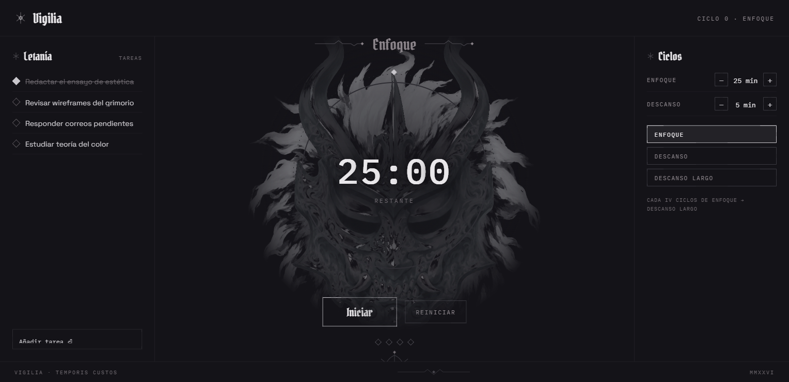

# Vigilia

Temporizador Pomodoro de escritorio con estética gótico-ciberpunk (paleta plata/carbón, tipografía Pirata One + IBM Plex Mono). Corre como una página web estática, sin dependencias ni build.

**▶ Pruébalo en vivo: [becerrahector.github.io/PomodoroSunless](https://becerrahector.github.io/PomodoroSunless/)**



## Características

- Ciclos de enfoque / descanso / descanso largo (cada 4 enfoques) con anillo de progreso animado.
- Lista de tareas ("Letanía") con persistencia local.
- Duraciones de enfoque y descanso ajustables (1–90 min).
- Estado (tareas, duraciones, ciclos completados) guardado en `localStorage`.
- Título de la pestaña actualizado en vivo con el tiempo restante.
- Campanada sutil al terminar cada ciclo.

## Uso

No requiere instalación. Basta con abrir `index.html` en el navegador, o servir la carpeta con cualquier servidor estático:

```bash
python -m http.server 8000
```

y visitar `http://localhost:8000/`.

## Estructura del proyecto

```
Pomodoro/
├── index.html       # Marcado de la aplicación
├── css/
│   └── styles.css   # Estilos
├── js/
│   └── app.js        # Estado y lógica del temporizador
├── assets/
│   └── mask-ghost.png
└── docs/
    └── preview.png
```

## Origen del diseño

Basado en la dirección de diseño "1a · Ritual" del proyecto [Claude Design](https://claude.ai) "Aplicación Pomodoro Ciberpunk".
